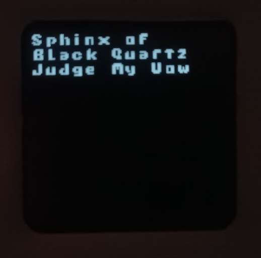

# Micropython Fontlib
A tiny micropython library for displaying 1-bit bitmap fonts and sprites, works with any monocrome or color screen through [framebuffer](https://docs.micropython.org/en/latest/library/framebuf.html)

# How to use it

### Using a font
Add fontlib.py and a 1bit font .bmp (Should follow the same formatting of the bmp files on the [fonts](https://github.com/Rumidom/Micropython_Fontlib/tree/main/fonts) folder) file to your micropython device, then use the library to modify a framebuffer:
```python
import framebuf
import fontlib
import ssd1306
from machine import Pin,I2C

screen_width = 128
screen_height = 32

#ESP8266 scl=Pin(4),sda=Pin(5)
#ESP32 C3 scl=Pin(9),sda=Pin(8)
i2c = I2C(scl=Pin(9),sda=Pin(8))
oled = ssd1306.SSD1306_I2C(screen_width, screen_height, i2c)

spce = 1 # characters spacing
pos_x = 0 # X position on the frame buffer to print the text
pos_y = 0 # Y position on the frame buffer to print the text

five = fontlib.font("five (5,5).bmp") # Loads font to ram 

fbuf = framebuf.FrameBuffer(oled.buffer, screen_width, screen_height, framebuf.MONO_VLSB)
fbuf.fill(0)
fontlib.prt("The Quick Gray",pos_x,pos_y,spce,fbuf,five) # prints text using font
oled.show()
```
see the [examples folder](https://github.com/Rumidom/Micropython_Fontlib/tree/main/examples) to see how to use it with diferent displays.

### Bliting a bitmap

```python
import framebuf
import fontlib
import ssd1306
from machine import Pin,I2C

screen_width = 128
screen_height = 32

#ESP8266 scl=Pin(4),sda=Pin(5)
#ESP32 C3 scl=Pin(9),sda=Pin(8)
i2c = I2C(scl=Pin(9),sda=Pin(8))
oled = ssd1306.SSD1306_I2C(screen_width, screen_height, i2c)

fbuf = framebuf.FrameBuffer(oled.buffer, screen_width, screen_height, framebuf.MONO_VLSB)
fbuf.fill(0)

pos_x = 0 # X position on the frame buffer to blit sprite
pos_y = 0 # Y position on the frame buffer to blit sprite
fontlib.drawBitmap('image.bmp',pos_x,pos_y,fbuf,invert=False):

oled.show()
```

# How to create new fonts
Most image editors should have a 1bit bmp option when saving bitmaps, I recommend [Paint.net](https://www.getpaint.net/), draw 1 pixel white padding around each letters, the file name should include the character size, like the fonts found in the [fonts](https://github.com/Rumidom/Micropython_Fontlib/tree/main/fonts) folder. on paint.net if you "save as" and choose bmp it will prompt you with "saving configuration" choose the 1bit option. alternatively you can create the font as a normal bmp file and convert it using [Pillow](https://pypi.org/project/pillow/):

```python
from PIL import Image

img = Image.open('input_image.png')
img = img.convert('1')
img.save('output_1bit.bmp')
```

# TODO
- [x] Load fonts directly from 1bit bitmaps
- [x] Support for portuguese special characters (ç,á,é,í,ó,ú,â,ê,ô,ã,õ)(Ç,Á,É,Í,Ó,Ú,Â,Ê,Ô,Ã,Õ).
- [x] Support for color screens

# Available fonts:
### [Futuristic 5X7](https://opengameart.org/content/ascii-bitmap-font-futuristic) [84x48 1.5 Inch Nokia 5110 LCD Screen]:    
  

### Five 5X5 (Created by the Author) [84x48 1.5 Inch Nokia 5110 LCD Screen]:  
  

### [Oldschool 5X7](https://opengameart.org/content/ascii-bitmap-font-oldschool) [84x48 1.5 Inch Nokia 5110 LCD Screen]:    
  

### [Cellphone 5X7](https://opengameart.org/content/ascii-bitmap-font-cellphone) [84x48 1.5 Inch Nokia 5110 LCD Screen]:  
  

### Icons 5X7 (Created by the Author) [84x48 1.5 Inch Nokia 5110 LCD Screen]:  
  

### [IBM BIOS 8x8](https://int10h.org/oldschool-pc-fonts/fontlist/font?ibm_bios) [120x120 1.28 Inch TFT round Screen]:    
  

### [IBM BIOS 16x16](https://int10h.org/oldschool-pc-fonts/fontlist/font?ibm_bios) [240x240 1.3 Inch TFT Screen]:    
  

### Pixelaudio 8x8 (Created by the Author) [1.5 Inch 128x128 OLED]:    
  

# LICENSE:
this project is [MIT licensed](https://github.com/Rumidom/micropython_fontlib/blob/main/LICENSE)

# Support
[](https://ko-fi.com/M4M41NQV7I)
